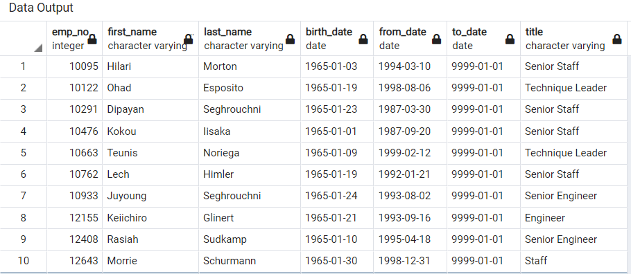
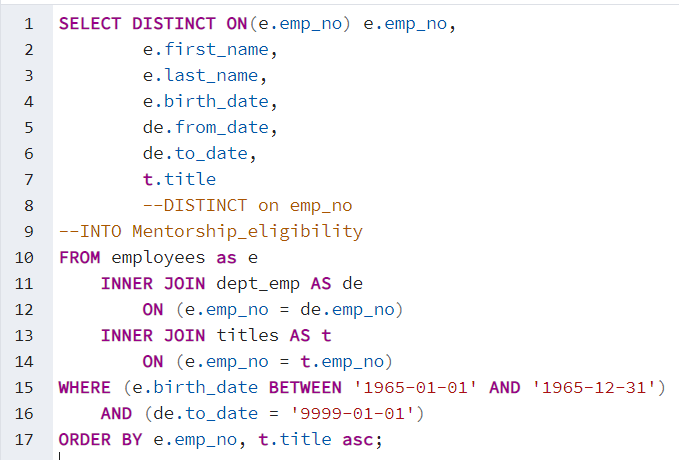
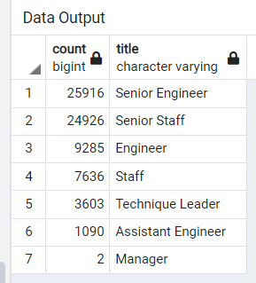
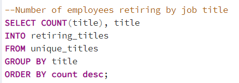
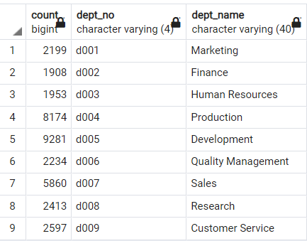

# Pewlett-Hackard-Analysis

## Overview of the analysis
The purpose of this analysis was to identify employees retiring from Pewlett Hackard based on title, birth date, and start date, and compile the data to provide a list of employees eligible for a mentorship program called "Silver Tsunami." In this program, retirement-eligible employees can change to a part time status and work with current employees to ease a very large workforce transition.

## Results
Below are the four major takeways from the analyses:
 - About 24% of Pewlett Hackard's total employees are eligible to retire, creating a need for current staff to fill their roles in a limited amount of time.

  

  

 - The majority of retirees are in Senior positions, requiring a quick turnaround in training in order for Pewlett Hackard to continue operating at the same level.

  

  

 - While there are only 2 managers eligible for retirement, there are 3603 Technique Leaders eligible for retirement. Assuming this is a leadership position, there is also a great need to replace these positions so there isn't a significant reduction in supervisory positions. 

 - Many employees have received promotions during their time at Pewlett Hackard, which is important to accurately note in the analysis in order to understand the total counts of each current title.

## Summary
A summary of this analyses is below, including an image for code used to determine number of employees in each department. If this code is refactored to include the number of total retiring employees by department, it may provide a better picture of where the company should redistribute employees for the mentorship program.

How many roles will need to be filled as the "silver tsunami" begins to make an impact? 72,458 roles will need to be filled, as this is the total number of employees eligible for retirement.

Are there enough qualified, retirement-ready employees in the departments to mentor the next generation of Pewlett Hackard employees? With 1549 employees eligible for the mentorship, it seems more are needed to adequately mentor current employees.

 

 
 